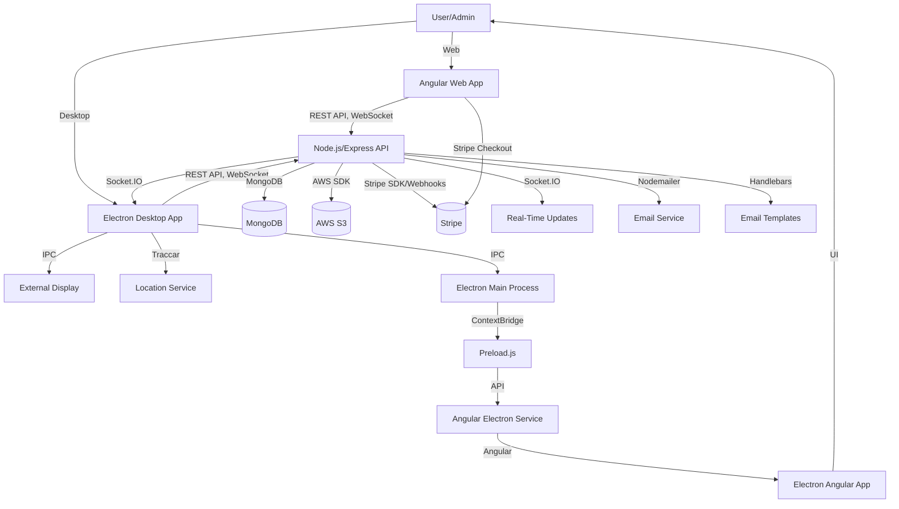
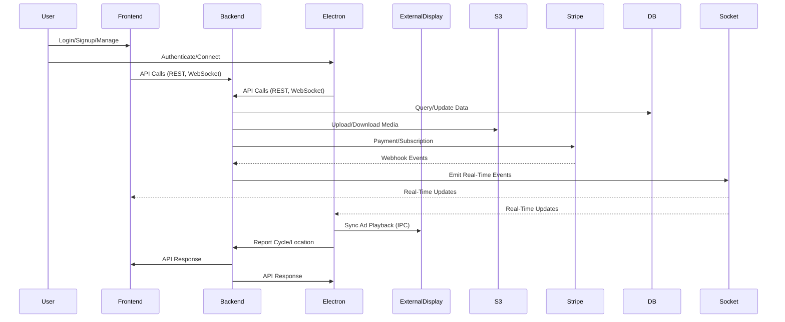
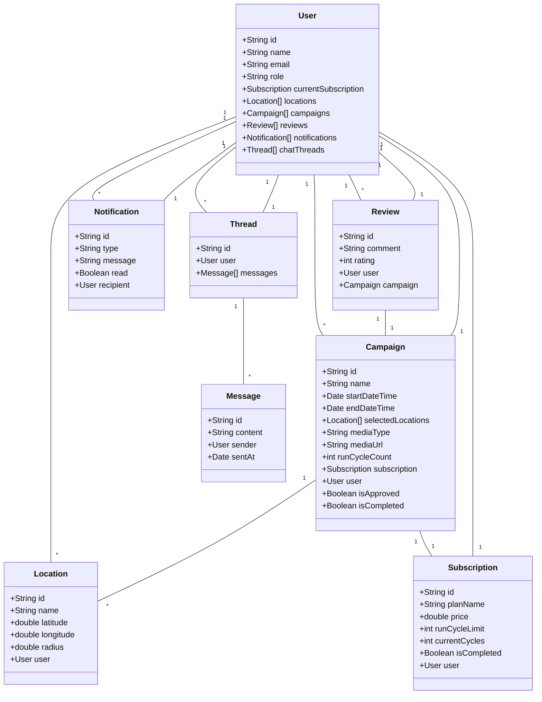
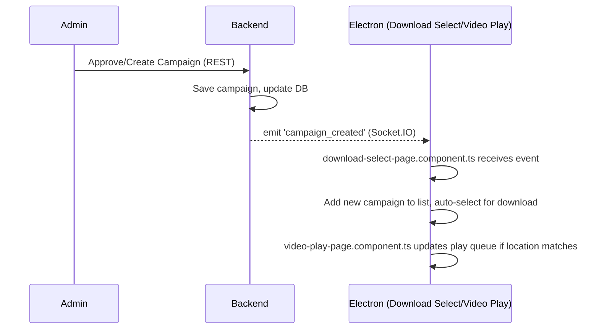
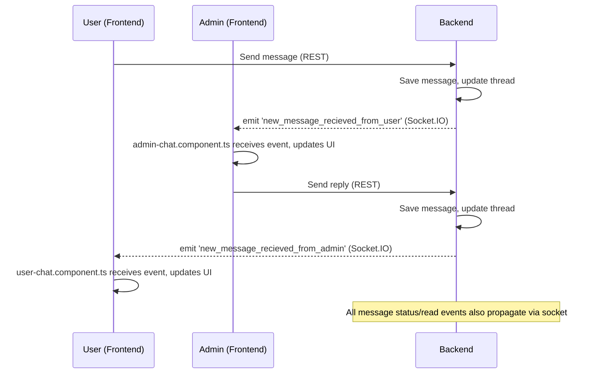

# HaulAdz Platform Documentation

> **This is the definitive, unified technical and conceptual overview of HaulAdz, integrating all three servers (Frontend, Backend, Electron), their data flows, relationships, and core logic.**

---

## Table of Contents
1. [Platform Overview](#platform-overview)
2. [High-Level Architecture](#high-level-architecture)
3. [Unified Data Flow](#unified-data-flow)
4. [Core Domain Model (UML)](#core-domain-model-uml)
5. [Socket Interactions: Real-Time Media and Chat Flows](#socket-interactions-real-time-media-and-chat-flows)
6. [Mathematical Logic (KaTeX)](#mathematical-logic-katex)
7. [Module-by-Module Deep Dive](#module-by-module-deep-dive)
8. [Security, Real-Time, and Error Handling](#security-real-time-and-error-handling)
9. [Getting Started](#getting-started)
10. [License](#license)

---

## Platform Overview

HaulAdz is a full-stack, distributed advertising platform for real-time, location-based campaign management and synchronized ad delivery. It consists of:

- **Frontend (Angular Web App):** User/admin interface for campaign, analytics, subscriptions, chat, and more.
- **Backend (Node.js/Express API):** Central business logic, data storage, authentication, payments, notifications, and real-time services.
- **Electron Desktop App:** Dedicated for ad playback in mobile environments, with real-time location filtering, download management, and external display sync.

All components communicate via secure APIs, WebSockets, and IPC (Electron), with shared data models and business rules enforced across the stack.

---

## High-Level Architecture



---

## Unified Data Flow



---

## Core Domain Model (UML)



---

## Socket Interactions: Real-Time Media and Chat Flows

HaulAdz leverages Socket.IO for real-time communication between the website (frontend), backend, and desktop app (Electron). This enables instant updates for new campaigns/media and seamless chat between users and admins. Below are the two core socket-driven flows:

---

### 1. Real-Time Media/Campaign Delivery

When a new campaign/media is created or approved, the backend emits a socket event to all connected Electron desktop apps. This ensures that the download select page and video play page are always up-to-date with the latest campaigns.

**Relevant files:**
- Electron: `download-select-page.component.ts`, `video-play-page.component.ts`
- Backend: `socketConfig.ts`, campaign controllers/services



**Flow Details:**
- When a campaign is created/approved, the backend emits a `campaign_created` event via Socket.IO (see `emitCampaignCreated` in `socketConfig.ts`).
- Electron's `download-select-page.component.ts` listens for this event, adds the campaign to the list, and auto-selects it for download.
- If the campaign is location-relevant, `video-play-page.component.ts` updates its play queue in real time.
- This ensures that new media is available for download and playback without manual refresh.

---

### 2. Real-Time Chat Communication (User ↔ Admin)

Both users (via the website) and admins (via the website or Electron) communicate through the same backend socket infrastructure. All chat messages, thread updates, and status changes are propagated in real time.

**Relevant files:**
- Frontend: `admin-chat.component.ts`, `user-chat.component.ts`
- Backend: `ChatController.ts`, `socketConfig.ts`
- Electron: (if chat is implemented, same pattern applies)



**Flow Details:**
- Users send messages via REST; backend saves and emits `new_message_recieved_from_user` to all admins (see `emitToAdmin` in `socketConfig.ts`).
- Admins' `admin-chat.component.ts` listens for this event, updating the UI in real time.
- Admin replies are saved and emitted as `new_message_recieved_from_admin` to the user (`emitToUser` in `socketConfig.ts`).
- Users' `user-chat.component.ts` listens for this event, updating the UI instantly.
- Message status updates (delivered/read) and thread status changes are also propagated via socket events, ensuring both parties see real-time feedback.
- All socket authentication and room management is handled in `socketConfig.ts`.

---

**Summary:**
- The backend acts as the real-time hub, emitting events for new campaigns/media and chat messages.
- Electron and frontend clients listen for these events, updating their UI and state instantly.
- This architecture ensures that all users, admins, and devices are always in sync, with no manual refresh required for critical updates.

---

## Mathematical Logic (KaTeX)

### Haversine Formula for Distance Calculation

The Electron app uses the Haversine formula to calculate the distance between two latitude/longitude points for campaign location filtering:

$$
d = 2r \arcsin\left(\sqrt{\sin^2\left(\frac{\Delta\varphi}{2}\right) + \cos(\varphi_1)\cos(\varphi_2)\sin^2\left(\frac{\Delta\lambda}{2}\right)}\right)
$$

Where:

- $d$ = distance between two points  
- $r$ = radius of the Earth (mean radius = 6,371 km)  
- $\varphi_1, \varphi_2$ = latitude of point 1 and 2 (in radians)  
- $\Delta\varphi$ = $\varphi_2 - \varphi_1$  
- $\Delta\lambda$ = longitude difference (in radians)  

---

## Module-by-Module Deep Dive

### Frontend (Angular Web Application)
- **Authentication:** Login, signup, password reset, OTP, Google OAuth. Role-based access and route guards.
- **Dashboard:** Analytics for users (campaign stats, plan usage) and admins (platform-wide metrics, revenue, growth).
- **Campaigns:** Multi-step creation, editing, approval/rejection (admin), media upload (S3), location targeting, real-time status.
- **Locations:** Add/edit/list locations with Google Maps, enforce plan/radius limits, geo-targeting for campaigns.
- **Available Locations:** Admins manage US states available for targeting.
- **Subscriptions:** Plan management (admin), purchase/renewal (user), Stripe integration, real-time updates.
- **Invoices:** View/manage invoices, formatted durations, status display.
- **Users:** Admin search, pagination, ban/unban, gift subscriptions, start chat.
- **Chat:** Real-time messaging for admins and users, multi-threaded, support chat, socket integration.
- **Reviews:** Add/edit/list (user), approve/reject/delete (admin), public display.
- **Settings/Roles:** Admin role/permission management, backend sync.
- **Website:** Public landing pages (home, contact, pricing), animated, responsive, dynamic content.

### Backend (Node.js/Express API)
- **Authentication & User Management:** Secure signup/login, OTP, Google OAuth, JWT, profile management, admin actions (ban/unban, gift subscriptions).
- **Campaigns:** CRUD, approval/rejection, media upload (S3), run cycle/location updates, driver/Electron integration, time window enforcement.
- **Locations & Available States:** CRUD, geo-targeting, subscription/radius limits, admin state management, campaign status flagging.
- **Subscriptions & Invoices:** Plan management, Stripe payments, webhooks, invoice aggregation, gifting, test clock.
- **Reviews:** User reviews, admin moderation, public display.
- **Chat:** Real-time messaging, thread/message management, admin/user flows, email notifications for offline users.
- **Notifications:** Event-driven, stored in DB, sent via socket/email, read/unread management.
- **Dashboard:** Aggregated analytics for users/admins, growth calculations, charts.
- **File Uploads:** Profile images/campaign media to AWS S3, presigned URLs.
- **Webhooks:** Stripe event handling, updates user/subscription/campaign data, emits real-time events.

### Electron Desktop App
- **Authentication:** Login, signup, OTP, password reset, Google OAuth.
- **Create Connection:** Guides user to connect to Traccar client for real-time location updates.
- **Download Select & Status:** View/select campaigns, initiate downloads, track progress, handle errors/retries.
- **Map Preview:** Visualize campaign/device locations, optimal routes (Google Maps).
- **Screen Selector:** Choose physical display for external (public-facing) screen, manage display config.
- **Video Play Page (Core):**
  - **Ad Playback:** Download/play campaign media (video/image) based on location/schedule, enforce run cycle limits.
  - **Download Management:** Download queue, progress tracking, error handling, retries.
  - **Play Queue:** Dynamic update as location/campaigns change, only valid campaigns played.
  - **Media Playback:** Video/image support, timers, transitions, UI feedback.
  - **External Display Sync:** Mirror playback on secondary display, IPC actions (load, play, pause, clear), robust error handling.
  - **Location & Map Integration:** Real-time location updates, play queue/UI update, Google Maps visualization.
  - **Subscription Enforcement:** Increment cycle count after playback, update backend, remove completed campaigns, warnings for nearing limits.
  - **Error Handling & Logging:** Extensive logging, UI feedback for errors/warnings.

---

## Security, Real-Time, and Error Handling

- JWT authentication, role-based access, context isolation (Electron), secure file uploads, robust error handling, and logging throughout.
- Real-time updates via Socket.IO and Electron IPC.
- Stripe is the source of truth for payments; webhooks update all related data.
- AWS S3 stores all media securely.

---

## Getting Started

1. **Install dependencies in all three servers:**
   ```bash
   npm install
   ```

2. **Set up environment variables:**
   - **Backend:**
     1. Copy `Backend/.env.example` to `Backend/.env`:
        ```bash
        cp Backend/.env.example Backend/.env
        ```
     2. Open `Backend/.env` and fill in all required values:
        - **Database:** `MONGO_URI`
        - **JWT:** `JWT_SECRET`, `JWT_EXPIRY`, `JWT_REFRESH_EXPIRY`
        - **AWS S3:** `AWS_ACCESS_KEY_ID`, `AWS_SECRET_ACCESS_KEY`, `AWS_REGION`, `AWS_S3_BUCKET`
        - **Stripe:** `STRIPE_SECRET_KEY`, `STRIPE_WEBHOOK_SECRET`
        - **SMTP/Email:** `SMTP_HOST`, `SMTP_USERNAME`, `SMTP_PASSWORD`, `SMTP_EMAIL`, `SMTP_PORT`, `EMAIL_FROM`
        - **Google OAuth:** `GOOGLE_CLIENT_ID`, `GOOGLE_CLIENT_SECRET`
        - **Other:** `TZ`, `FRONTEND_URL`, etc.
     3. Save the file.

   - **Frontend:**
     1. Open both `Frontend/src/environments/environment.development.ts` and `Frontend/src/environments/environment.ts`.
     2. Update the following fields as needed:
        - `BACKEND_URL`: The URL of your backend API (e.g., `http://localhost:3000`)
        - `APP_URL`: The URL of your frontend app (e.g., `http://localhost:4200`)
        - `STRIPE_PUBLIC_KEY`: Your Stripe publishable key
        - `googleMapsApiKey`: Your Google Maps API key
        - `TZ`: Your desired timezone (e.g., `America/Chicago`)
     3. Save both files.

3. **Run the servers:**
   - **Frontend:**
     ```bash
     ng serve
     ```
   - **Backend:**
     ```bash
     npm start
     ```
   - **Electron:**
     ```bash
     npm run electron:start
     ```

4. **Access the platform:**
   - Frontend: [http://localhost:4200](http://localhost:4200)
   - Backend API: [http://localhost:3000/api/](http://localhost:3000/api/)
   - Electron: Follow on-screen instructions for connection, campaign selection, and playback.

---

## License

This project is proprietary and not open source. All rights reserved. 